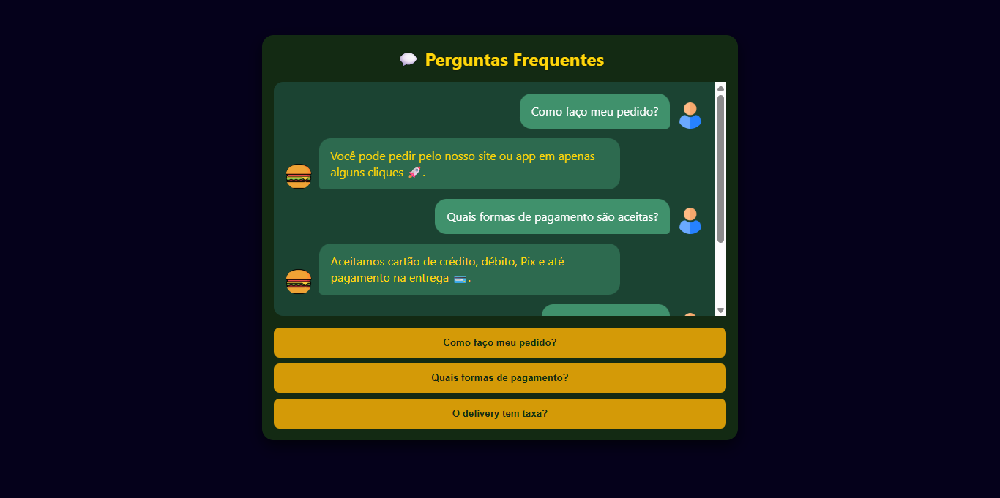

# 💬 FAQ Animado com Bolhas

---

## 🔹 Descrição do Projeto

Este projeto é um **FAQ interativo** inspirado em aplicativos de chat, desenvolvido com **HTML, CSS e JavaScript puro**, contendo:

- Bolhas animadas no fundo para chamar atenção.
- Janela de chat simulando interação entre **usuário** e **bot**.
- Botões clicáveis para exibir respostas das perguntas frequentes.
- Animação de "digitando..." para dar dinamismo.
- Layout responsivo e moderno.

O objetivo é servir como um **estudo prático de animações, DOM e interação dinâmica**.

---

## 📁 Estrutura do Projeto

faq-bolhas/ 
│ 
├─ index.html # Estrutura HTML do projeto 
├─ style.css # Estilos e animações das bolhas e chat 
├─ script.js # Lógica de exibição das mensagens 
├─ images/ 
│ ├─ faq.png # Banner ou screenshot do projeto 
│ ├─ faq-demo.gif # Demonstração animada do FAQ 

---

## 🎨 Tecnologias Utilizadas

- **HTML5** - Estrutura do projeto
- **CSS3** - Estilização e animações (bolhas, fadeIn, blink)
- **JavaScript** - Lógica de interação com DOM, mensagens dinâmicas e animações do chat

---

## 📸 Screenshots

**Janela de Chat com Bolhas Animadas:**

**GIF Demonstrativo da Interação:**

---

## 📝 Funcionalidades

- **Bolhas animadas:** Bolhas coloridas sobem pelo fundo usando `@keyframes rise`.
- **Chat dinâmico:** Usuário clica em perguntas e respostas aparecem automaticamente.
- **Efeito digitando:** Mensagem temporária "Digitando..." antes de mostrar a resposta.
- **Avatares:** Ícones diferenciados para usuário e bot.
- **Responsividade:** Layout adaptável para diferentes tamanhos de tela.
- **Hover:** Botões de perguntas mudam de cor ao passar o mouse.

  ---

  ## Feito com ❤️ por Samira
